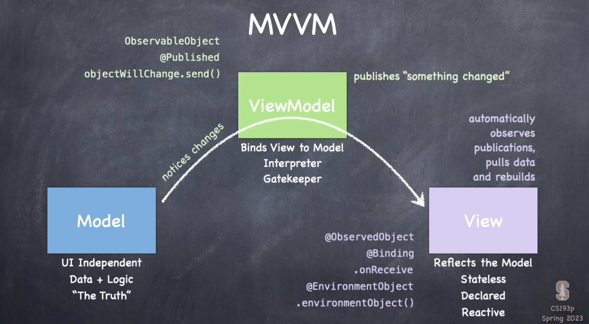
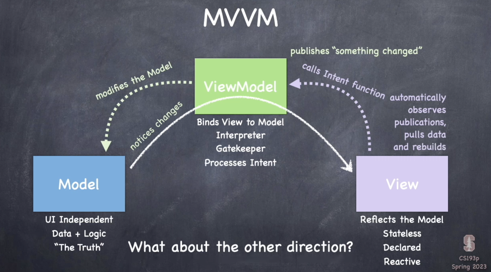

# Model-View-View Model

- Seperation of application logic & data from the UI.

- The logic is called the model

- The UI is a "parameterizable" shell that the Model feeds and brings it to life. Think of the UI as a visual manifestation of the Model.

- SwiftUI takes care of making sure the UI gets rebuilt when a Model change affects the UI.

# Model and UI

1. Rarely, the Model could just be an @state in a View (minmal to no seperation).
2. The Model might only be accessible via a gatekeeper "View Model" class (full seperation).
3. There is a View Model class, but the Model is still directly accessible (partial seperation).

# Diagrams

